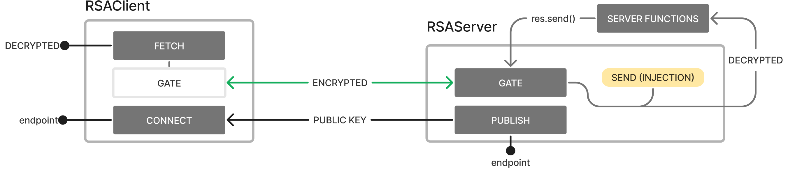

# RSA-BRIDGE

###### Encrypted communication bridge between client and server using [Node-RSA](https://www.npmjs.com/package/node-rsa) library.

- Encrypted Communication
- Streamlined Client-Server Integration
- Development simplification
- Key Generation
- Powered by a solid library

The library uses Node-RSA to create a bridge between server-client with encrypted communication, enabling secure end-to-end communication.



## Example

RSA Bridge Server Instance

```js
import { RSAServer } from "rsa-bridge";
const rsa = new RSAServer({ bits: 1024 });

app.use(
  rsa.gate((req, res, next) => {
    // your handler functions
  })
);
```

RSA Bridge Client Instance

```js
import { RSAClient } from "rsa-bridge";
const rsa = new RSAClient({ bits: 1024 });

rsa.connect();
rsa.fetch(INPUT, OPTIONS);
```

### Installing

```sh
npm install rsa-bridge
```

#### Testing

```sh
npm test
```

---

## Usage

Its use is divided into an **client** instance (`RSAClient`) and an **server** instance (`RSAServer`).
The **server instance** must expose the public key (`publish`) and have the middleware (`gate`) to inject RSA into the handler.
The **client instance** must have the public key exposure endpoint (`connect`) to encrypt the data.

#### Instantiating

<a name="instantiating"></a>
To instantiate the service on the server it is necessary to specify `bits` or `keys` that will be used.
Below is an example of instantiating the model used both on the server and on the client

```javascript
import { BasicRSA } from "rsa-bridge";
const rsa = new BasicRSA(BasicRSAConfig);
```

- **random** - <span style="color: purple;">BasicRSAConfig</span> - you can generate random keys by entering the `bits`

```js
{
  bits: number;
}
```

- **custom** - <span style="color: purple;">BasicRSAConfig</span> - you can specify your keys using the configuration below

```js
{
  keys: {
    private: string,
    public: string,
    ...
  }
}
```

### Client-side

#### Instantiating

The instance configuration is the same as found [here](#instantiating). Although it is possible, a `custom` key is <span style="color: red">not recommended</span> for clients.

```javascript
import { RSAClient } from "rsa-bridge";
const rsa = new RSAClient(BasicRSAConfig);
```

#### Connect

Obtains a connection to the server's RSA service, via the endpoint defined for public key exposure.
The `PATH` must point to the address defined [here](#expose).

```javascript
rsa.connect(PATH);
```

#### Fetch

Execute a request to the server using the encryption bridge.

```javascript
rsa.fetch(INPUT, OPTIONS).then(({ body, response }) => {
  // decrypted data
});
```

### Server-side

#### Instantiating

The instance configuration is the same as found [here](#instantiating).

```javascript
import { RSAServer } from "rsa-bridge";
const rsa = new RSAServer(BasicRSAConfig);
```

#### Publish

<a name="expose"></a>
The public key must be exposed for the bridge to work. The method must be **`GET`**.

```javascript
app.get(PATH, rsa.publish);
```

- **path** - <span style="color: darkblue;">string</span> - the HTTP path

#### Gate

It can be used as a **middleware**, propagating the service to **all routes**

```javascript
app.use(rsa.gate);
app.post("example", HANDLER);
```

It can also be used on a , as in the **single path**

```javascript
app.post("/example", rsa.gate(HANDLER));
```

#### Getting Data

If the request passed the gate, the data sent in the body can be obtained

```javascript
app.use(rsa.gate);
app.post("/example", (req, res) => {
  req.body; // decrypted data
});
```

#### Send

The `send` function will be wrapped by the `gate` to encrypt the data before sending it to the client.
Predecessors like `.json()` and `.status()` can be used as well.

```javascript
app.use(rsa.gate);
app.post("/example", (req, res) => {
  res.status(200).send(DATA); // L0SQ23.....
});
```

The wrapped `res` will extend throughout the _request_ until the _response_, even with the use of `next()` for example.

```javascript
app.use(rsa.gate);
app.use((req, res, next) => {
  next();
});
app.use((req, res) => {
  res.status(200).json(DATA); // L0SQ23.....
});
```

### Basic RSA Functions

#### Encrypt

Returns encrypted data as `base64`

```javascript
const encrypted = rsa.encrypt(data);
```

#### Decrypt

returns decrypted data as `utf8`

```javascript
const decrypted = rsa.decrypt(data);
```

#### encryptWithKey

returns encrypted data as `base64` encrypted with a different key

```javascript
const encrypted = rsa.encryptWithKey(key, data, format?);
```

#### publicKey

exports the node's public key. The default encoding is "UTF8" but can be changed.

```javascript
const publicKey = rsa.publicKey(KeyFormat, OutputEncoding);
```

---

### ReactJS Example

An example implementation with reactJS is available in [examples](https://github.com/HugoRodriguesQW/rsa-bridge/tree/main/examples). There is a live version at [https://rsa-bridge.vercel.app](https://rsa-bridge.vercel.app)

<a href="https://pkg-size.dev/rsa-bridge"></a> <a href="https://pkg-size.dev/rsa-bridge"> </a>[](https://github.com/HugoRodriguesQW/rsa-bridge/actions/workflows/testing.yml)  
